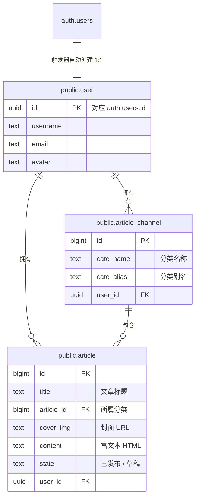

<div align="center">

<a id="top"></a>


# 📰 大事件 · Big Event CMS

**一个基于 Vue 3 + Supabase 的全栈内容管理系统（CMS）**

_Full-stack content management system built with Vue 3 + Supabase — **no backend code required**_

用 Supabase 的 `Auth` + `PostgreSQL` + `Storage` 替代整个后端，一套 Vue 代码打通全栈，适合初学者快速入门现代全栈开发。

<p>
<a href="#quick-start">🚀 快速开始</a> ·
<a href="#project-structure">📁 项目结构</a> ·
<a href="#database-schema">🗄️ 数据库设计</a> ·
<a href="#live-demo">🌐 在线体验</a>
</p>


</div>

> ⭐ 如果这个项目对你有帮助，欢迎点个 **Star** 支持作者 —— 你的 Star 是我持续更新的动力！
> If this project helps you, a ⭐ Star is the best support!

---

## ✨ 项目亮点 / Highlights

- 🎓 **零后端代码的全栈体验** —— 认证、数据库、文件存储、行级安全全部由 Supabase 完成，前端一套 Vue 代码打通全栈
- 🧭 **新手友好** —— 目录分层清晰（`api` / `stores` / `router` / `views`），每个功能都遵循 Vue 3 最佳实践
- ⚡ **开箱即用** —— 一条 SQL 建表脚本 + 环境变量即可跑通全部功能
- 🔒 **真实生产特性** —— 邮箱认证、富文本编辑、图片上传、分页筛选、RLS 行级安全

> 🎓 **适合谁？** 学完 Vue 基础想挑战第一个完整项目的人；想知道「不写后端怎么开发全栈应用」的人；准备找工作想攒一个完整项目经历的人。

---

<a id="live-demo"></a>

## 🌐 在线体验 / Live Demo

> 后端（Supabase 实例）已在线，**无需自建后端**即可体验全部功能，部署前端后即可访问。

<!-- ⭐ 部署完成后，把下面占位链接替换成你的线上地址 -->

**在线体验：** <code>https://dashijian.vercel.app</code>

- 打开页面 → 注册一个账号即可开始使用（免费实例默认需邮箱确认，可在 Supabase → Auth → Email 关闭 **Confirm email** 免验证）
- 还没有部署？见下方 [🚢 部署 / Deployment](#deployment)，一分钟搞定

---

## 🖼️ 功能预览 / Screenshots

> 请将截图放到 `docs/` 目录后，取消下方注释即可在首页展示（建议 3 张：登录 / 文章管理 / 富文本编辑）。

<!--
<div align="center">
  
  
  
</div>
-->

---

## ✅ 功能特性 / Features

- [x] 📮 邮箱 + 密码注册 / 登录，注册后自动创建用户档案（触发器）
- [x] 🛡️ 路由守卫：未登录自动跳转登录页
- [x] 🗂️ 文章分类管理：增删改查 + 表单校验
- [x] 📝 文章管理：发布 / 草稿双状态，分类 + 状态筛选，分页
- [x] 🖊️ 富文本编辑器（Vue Quill）撰写文章
- [x] 🖼️ 封面图 / 头像上传至 Supabase Storage
- [x] 👤 个人资料：昵称、头像修改
- [x] 🔑 安全中心：重置密码、更换邮箱（双重邮箱确认）

---

## 🧩 技术栈 / Tech Stack

| 分类 Category   | 技术 Tech                                     |
| --------------- | --------------------------------------------- |
| 前端框架        | Vue 3（`<script setup>` 组合式 API）          |
| 构建工具        | Vite 8                                        |
| 状态管理        | Pinia + pinia-plugin-persistedstate（持久化） |
| 路由            | Vue Router 5（含登录守卫）                    |
| UI 组件库       | Element Plus（unplugin 自动按需导入）         |
| 富文本          | @vueup/vue-quill                              |
| 样式            | SCSS                                          |
| 后端即服务 BaaS | Supabase Auth / PostgreSQL / Storage          |
| 代码质量        | ESLint + Prettier + Husky + lint-staged       |

---

<a id="project-structure"></a>

## 📁 项目结构 / Project Structure

```
src/
├─ api/                    # 数据访问层（封装所有 Supabase 请求）
│  ├─ article.js           # 文章 & 分类相关接口
│  └─ user.js              # 认证 & 用户资料接口
├─ assets/                 # 全局样式与静态资源
├─ components/
│  └─ PageContainer.vue    # 页面容器（可复用卡片布局）
├─ router/index.js         # 路由 + 登录守卫
├─ stores/
│  ├─ index.js             # Pinia 初始化 & 统一导出
│  └─ mods/user.js         # 用户状态（持久化）
├─ utils/
│  ├─ paginate.js          # 前端分页工具函数
│  └─ request.js           # Supabase 客户端单例
└─ views/
   ├─ login/LoginPage.vue         # 登录 / 注册
   ├─ layout/LayoutContainer.vue  # 主布局（侧边栏 + 顶栏）
   ├─ article/
   │  ├─ ArticleChannel.vue       # 文章分类管理
   │  ├─ ArticleManage.vue        # 文章管理
   │  └─ components/              # ChannelEdit / ChannelSelect / ArticleEdit
   └─ user/
      ├─ UserProfile.vue          # 基本资料（昵称 / 头像）
      └─ UserPassword.vue         # 重置密码 / 更换邮箱

supabase/
└─ schema.sql              # 数据库初始化脚本（建表 + 触发器 + RLS + 存储桶）
```

---

<a id="quick-start"></a>

## 🚀 快速开始 / Quick Start

### 环境要求 / Prerequisites

- Node.js ≥ 22
- pnpm（`npm i -g pnpm`）
- 一个免费的 Supabase 项目（注册 https://supabase.com 即可）

### 第 1 步：克隆并安装 / Clone & install

```bash
git clone https://github.com/<your-username>/<your-repo>.git
cd <your-repo>
pnpm install
```

### 第 2 步：初始化数据库 / Initialize the database

在 Supabase Dashboard 打开 **SQL Editor**，粘贴 [supabase/schema.sql](supabase/schema.sql) 全部内容并点击 Run。

一条脚本完成全部初始化：

- 建表：`user` / `article_channel` / `article`
- 触发器：用户注册成功后自动在 `user` 表创建档案行
- 安全：所有表开启 RLS（行级安全），数据按用户隔离
- 存储：创建 `cover_img`（文章封面）、`avatar`（用户头像）两个公开存储桶

### 第 3 步：配置环境变量 / Configure env

复制 `.env.example` 为 `.env`，填入你的 Supabase 项目信息：

```bash
cp .env.example .env
```

| 变量                     | 说明      | 获取位置                                 |
| ------------------------ | --------- | ---------------------------------------- |
| `VITE_SUPABASE_URL`      | 项目地址  | Project Settings → API → Project URL     |
| `VITE_SUPABASE_ANON_KEY` | anon 公钥 | Project Settings → API → anon public key |

> 💡 仓库自带一份可用的 `.env`（作者的开源实例），clone 下来即可直接运行；更推荐换成你自己的项目，数据完全隔离。

### 第 4 步：启动 / Run

```bash
pnpm dev
```

访问 http://localhost:5173 ，注册账号即可开始使用。

---

<a id="database-schema"></a>

## 🗄️ 数据库设计 / Database Schema



| 表 Table          | 说明 Description                        |
| ----------------- | --------------------------------------- |
| `user`            | 用户资料，注册时由触发器自动创建        |
| `article_channel` | 文章分类，每个用户各自独立              |
| `article`         | 文章（标题 / 封面 / 富文本内容 / 状态） |

### 🔐 安全设计 / Security

- 所有表均开启 **RLS（行级安全）**，用户只能访问 `user_id = auth.uid()` 的数据 —— 所以 anon key 即使公开，也无需担心数据泄露
- 文件上传路径按 `user_id/...` 组织，Storage 策略同样做了用户隔离
- 项目只使用 **anon / publishable key**，`service_role` 密钥绝不提交（见 `.env.example` 中的警告）

---

<a id="deployment"></a>

## 🚢 部署 / Deployment

前端是纯静态站点，可一键部署到 Vercel / Netlify / Cloudflare Pages：

1. 将仓库推送到 GitHub
2. Vercel → New Project → Import 该仓库
3. 框架选择 Vite，其余默认即可
4. 部署完成后访问你的线上地址（后端已在 `.env` 中配置好）

> 也可以 fork 后替换为自己的 Supabase 项目，数据完全归你所有。

---

## 🤝 参与贡献 / Contributing

欢迎任何形式的贡献：提 Issue、提交 PR、反馈使用体验。

1. Fork 本项目
2. 创建功能分支：`git checkout -b feature/xxx`
3. 提交：`git commit -m "feat: xxx"`
4. 推送：`git push origin feature/xxx`
5. 提交 Pull Request

---

## 📄 开源协议 / License

**MIT License** © 小琳琳 · 详见 [LICENSE](LICENSE)

[⬆️ 回到顶部](#top)
